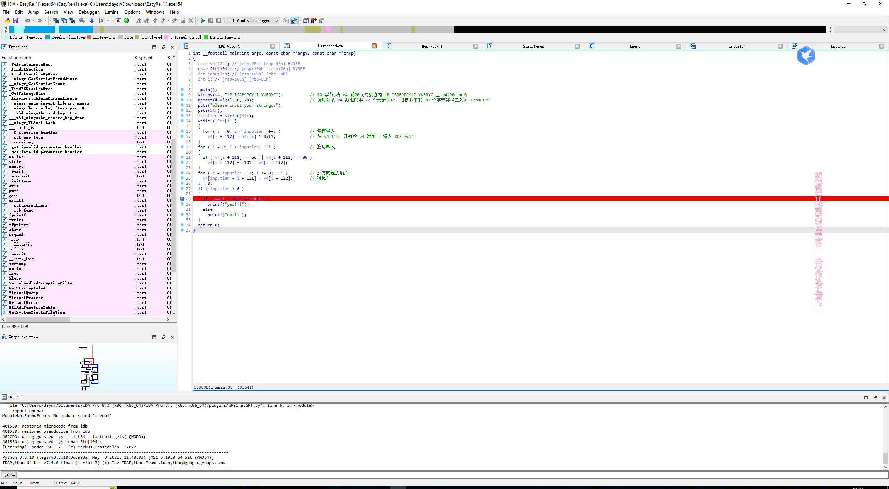
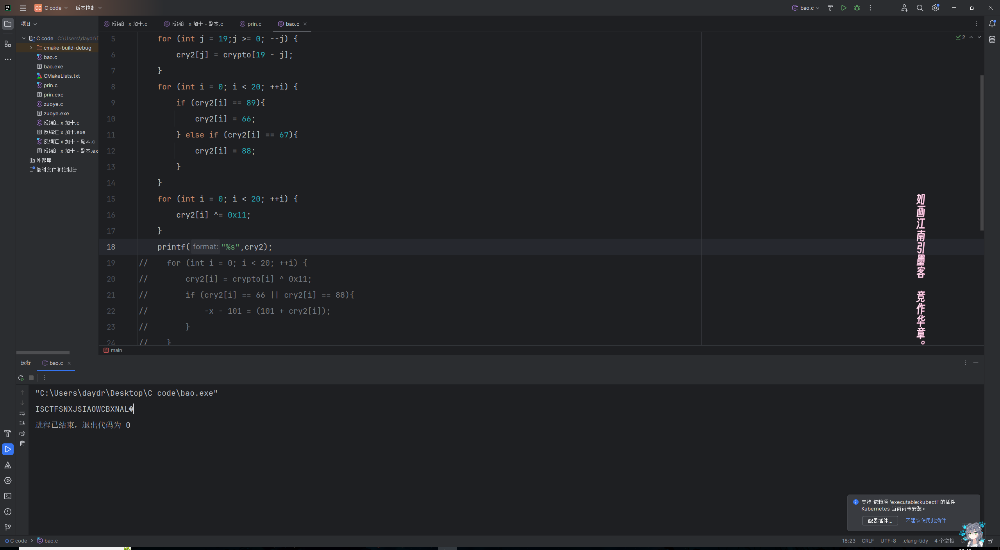
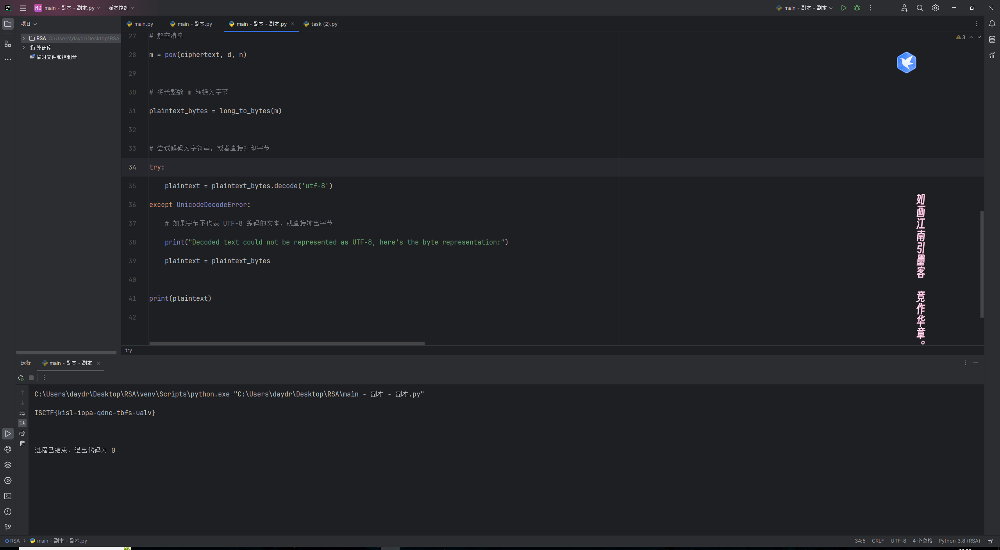

# 2023-13周周报

## 本周概况

- 时间与精力主要在 ISCTF 上
### 新知

- 流量包文件[pcgpng] 的简单分析
- 流量包文件中 键盘 流量的简单分析 提取 回溯
- snow[HTML] 隐写

### 所做练习

#### ISCTF

- [test_nc]
- [nc_shell]
- [七七的欧拉]
- [杰伦可是流量明星]
- [小白小黑]
- [ezUSB]
- [EasyRe]
- [babyRe]
- [easy_z3]
- [张万森,下雪了]
- [Ez_misc]
- [easy_zip]
- [小猫]
- [crackme]

## 下周展望

- 再打两天 ISCTF 然后深度复盘相关题目 总结通用优势打法

## 其他 - ISCTF 个人题解

### 「Re」


### crackme

- 

### EasyRe

- 拖进IDA分析
- 
- 写个脚本回溯flag
```C
#include "stdio.h"
int main () {
    char crypto[20] = "]P_ISRF^PCY[I_YWERYC";
    char cry2[20];
    for (int j = 19;j >= 0; --j) {
        cry2[j] = crypto[19 - j];
    }
    for (int i = 0; i < 20; ++i) {
        if (cry2[i] == 89){
            cry2[i] = 66;
        } else if (cry2[i] == 67){
            cry2[i] = 88;
        }
    }
    for (int i = 0; i < 20; ++i) {
        cry2[i] ^= 0x11;
    }
    printf("%s",cry2);
    return 0;
}
```
- 
- 去掉后面的奇怪符号验证md5值正确
- 
- 微调一下提交
- ISCTF{SNXJSIAOWCBXNAL}
### easy_z3


- 套用 SHCTF 时相似题的旧脚本
```Python
from sympy import symbols, Eq, solve

# 定义未知数
l = symbols('l0:6')

# 定义方程组
equations = [
    Eq(593*l[5] + 997*l[0] + 811*l[1] + 258*l[2] + 829*l[3] + 532*l[4], 0x54eb02012bed42c08),
    Eq(605*l[4] + 686*l[5] + 328*l[0] + 602*l[1] + 695*l[2] + 576*l[3], 0x4f039a9f601affc3a),
    Eq(373*l[3] + 512*l[4] + 449*l[5] + 756*l[0] + 448*l[1] + 580*l[2], 0x442b62c4ad653e7d9),
    Eq(560*l[2] + 635*l[3] + 422*l[4] + 971*l[5] + 855*l[0] + 597*l[1], 0x588aabb6a4cb26838),
    Eq(717*l[1] + 507*l[2] + 388*l[3] + 925*l[4] + 324*l[5] + 524*l[0], 0x48f8e42ac70c9af91),
    Eq(312*l[0] + 368*l[1] + 884*l[2] + 518*l[3] + 495*l[4] + 414*l[5], 0x4656c19578a6b1170)
]

# 解方程组
solution = solve(equations)

# 如果找到解，则转换为字节并打印
if solution:
    for symbol, value in solution.items():
        # 将 SymPy Integer 转换为 Python int
        int_value = int(value)
        # 计算需要多少字节来表示这个数字
        num_bytes = (int_value.bit_length() + 7) // 8
        # 将数字转换为字节
        value_bytes = int_value.to_bytes(num_bytes, byteorder='big')
        print(f"{symbol} in bytes: {value_bytes}")
else:
    print("No solution found.")

```
- 

#### babyRe


- 盲猜 e=65537
```Python
from sympy import symbols, solve
from Crypto.Util.number import long_to_bytes

# 提供的数据
sum_p_q = 292884018782106151080211087047278002613718113661882871562870811030932129300110050822187903340426820507419488984883216665816506575312384940488196435920320779296487709207011656728480651848786849994095965852212548311864730225380390740637527033103610408592664948012814290769567441038868614508362013860087396409860
product_p_q_plus1 = 21292789073160227295768319780997976991300923684414991432030077313041762314144710093780468352616448047534339208324518089727210764843655182515955359309813600286949887218916518346391288151954579692912105787780604137276300957046899460796651855983154616583709095921532639371311099659697834887064510351319531902433355833604752638757132129136704458119767279776712516825379722837005380965686817229771252693736534397063201880826010273930761767650438638395019411119979149337260776965247144705915951674697425506236801595477159432369862377378306461809669885764689526096087635635247658396780671976617716801660025870405374520076160
ciphertext = 5203005542361323780340103662023144468501161788183930759975924790394097999367062944602228590598053194005601497154183700604614648980958953643596732510635460233363517206803267054976506058495592964781868943617992245808463957957161100800155936109928340808755112091651619258385206684038063600864669934451439637410568700470057362554045334836098013308228518175901113235436257998397401389511926288739759268080251377782356779624616546966237213737535252748926042086203600860251557074440685879354169866206490962331203234019516485700964227924668452181975961352914304357731769081382406940750260817547299552705287482926593175925396

# 假定的公钥指数 e
e = 65537

# 使用 sympy 解方程得到 p 和 q
p, q = symbols('p q')
eq1 = p + q - sum_p_q
eq2 = (p + 1)*(q + 1) - product_p_q_plus1
solutions = solve((eq1, eq2), (p, q))
p = int(solutions[0][0])
q = int(solutions[0][1])

# 计算 n 和 phi(n)
n = p * q
phi_n = (p - 1) * (q - 1)

# 计算私钥 d
d = pow(e, -1, phi_n)

# 解密消息
m = pow(ciphertext, d, n)

# 将长整数 m 转换为字节
plaintext_bytes = long_to_bytes(m)

# 尝试解码为字符串，或者直接打印字节
try:
    plaintext = plaintext_bytes.decode('utf-8')
except UnicodeDecodeError:
    # 如果字节不代表 UTF-8 编码的文本，就直接输出字节
    print("Decoded text could not be represented as UTF-8, here's the byte representation:")
    plaintext = plaintext_bytes

print(plaintext)

```
- 

### 「Misc」

- 因不是本方向学习原因所以放个人博客
http://mingyifuzi.cn/index.php/archives/81/