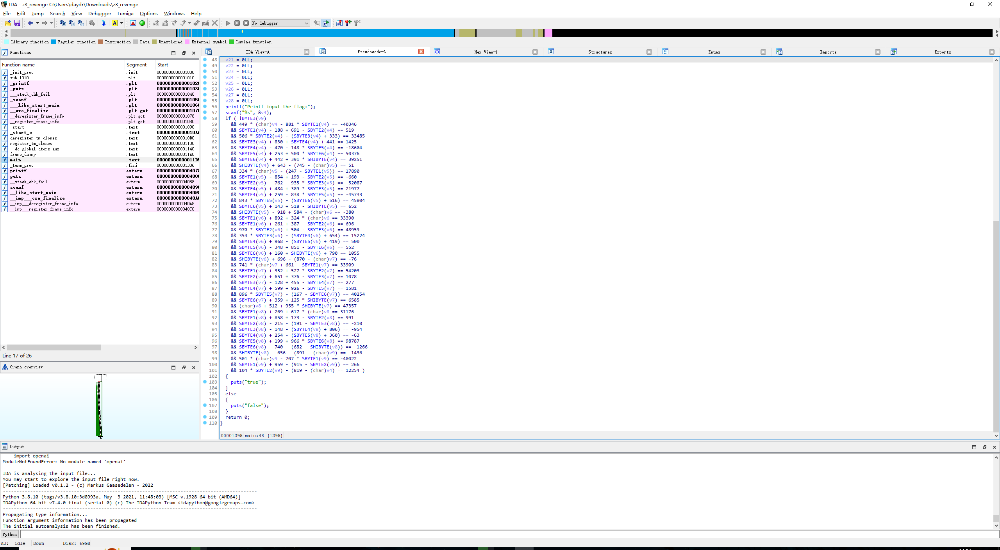
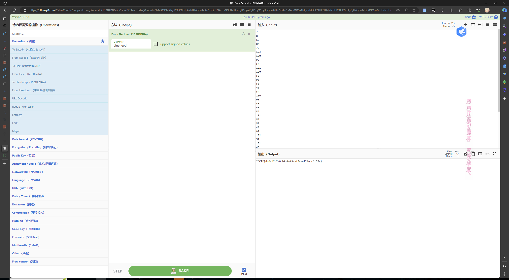

# 2023-12周周报

## 本周概况

- 前几天继续专注于 ISCTF 的解题
- 然后花了一天的时间赶 WP
- 接着进行没做出来的部分题目复现与相关知识的学习

### 新知

- 流量分析题型 Sql盲注 的简单分析
- 零宽隐写的解密
- 简单的 CRC 爆破压缩包中的加密 txt 文件内容
- 一种魔改 UPX 壳的处理方式
- UPX 手动脱壳
- SSH 通过库劫持 + sudo 运行 Python 脚本获得 shell
- SSH 通过劫持环境更改命令


### 所做练习

#### ISCTF

- [stream]
- [MCSOG-猫猫]
- [Wonderful New World]
- [z3_revenge]
- [EZcrc]
- [一心不可二用]
- [PNG的基本食用]
- [镜流]
- [sudopy]
- [status]

## 下周展望

- 继续 RE 相关内容的学习
- 提升下汇编语言的熟练度

## 其他-每日所学

### 周一

- 流量分析题型 Sql盲注 的简单分析
- 做题 [stream]
### 周二

- SSH 通过库劫持 + sudo 运行 Python 脚本获得 shell
- SSH 通过劫持环境更改命令
- 零宽隐写的解密
- 简单的 CRC 爆破压缩包中的加密 txt 文件内容
- 做题
    * [MCSOG-猫猫]
    * [Wonderful New World]
    * [z3_revenge]
    * [EZcrc]
    * [一心不可二用]
    * [PNG的基本食用]
    * [镜流]
    * [sudopy]
    * [status]


### 周三

- 爆肝 ISCTF WriteUp
### 周四

- 复盘 [ISCTF2023 - mfx_re]

### 周五

- 复盘 ISCTF 


### 周六 & 周天

- 安装 RetDec
- 复盘 ISCTF 部分题目
## 其他 - ISCTF 个人题解

### 「Re」

#### z3_revenge

- 扔 IDA PRO 分析
- 
- EXP:
```Python
from z3 import *

# 创建求解器实例
solver = Solver()

# 创建变量列表
A = [Int(f'A{i}') for i in range(0, 45)]  # A1到A43

# 添加方程作为约束

solver.add(449 * A[1]- 881 * A[2]== -40346)
solver.add(A[2]- 188 + 691 - A[3]== 519)
solver.add(506 * A[3]- (A[4]+ 333) == 33485)
solver.add(A[4]+ 830 + A[5]+ 441 == 1425)
solver.add(A[5]- 470 - 148 * A[6]== -18604)
solver.add(A[6]+ 253 + 500 * A[7]== 50376)
solver.add(A[7]+ 442 + 391 * A[8]== 39251)
solver.add(A[8]+ 643 - (745 - A[9]) == 51)
solver.add(334 * A[9]- (247 - A[10]) == 17890)
solver.add(A[10] - 854 + 193 - A[11] == -660)
solver.add(A[11] - 762 - 935 * A[12] == -52087)
solver.add(A[13] + 484 + 389 * A[12] == 21977)
solver.add(A[13] + 259 - 838 * A[14] == -45733)
solver.add(843 * A[14] - (A[15] + 516) == 45804)
solver.add(A[15] + 143 + 518 - A[16] == 652)
solver.add(A[16] - 918 + 584 - A[17] == -380)
solver.add(A[18] + 892 + 324 * A[17] == 33390)
solver.add(A[18] + 261 + 387 - A[19] == 696)
solver.add(970 * A[19] + 504 - A[20] == 48959)
solver.add(354 * A[20] - (A[21] + 654) == 15224)
solver.add(A[21] + 968 - (A[22] + 419) == 500)
solver.add(A[22] - 348 + 851 - A[23] == 552)
solver.add(A[23] + 160 + A[24] + 790 == 1055)
solver.add(A[24] + 696 - (870 - A[25]) == -76)
solver.add(741 * A[25] + 661 - A[26] == 33909)
solver.add(A[26] + 352 + 527 * A[27] == 54203)
solver.add(A[27] + 651 + 376 - A[28] == 1078)
solver.add(A[28] - 128 + 455 - A[29] == 277)
solver.add(A[29] + 599 + 926 - A[30] == 1581)
solver.add(896 * A[30] - (167 - A[31]) == 40254)
solver.add(A[31] + 359 + 125 * A[32] == 6585)
solver.add(A[33] + 512 + 955 * A[32] == 47357)
solver.add(A[34] + 269 + 617 * A[33] == 31176)
solver.add(A[34] + 858 + 173 - A[35] == 991)
solver.add(A[35] - 215 - (191 - A[36]) == -210)
solver.add(A[36] - 148 - (A[37] + 806) == -954)
solver.add(A[37] + 254 - (A[38] + 360) == -63)
solver.add(A[38] + 199 + 966 * A[39] == 98787)
solver.add(A[39] - 740 - (682 - A[40]) == -1266)
solver.add(A[40] - 656 - (891 - A[41]) == -1436)
solver.add(501 * A[41] - 707 * A[42] == -40022)
solver.add(A[42] + 959 - (915 - A[43]) == 266)
solver.add(104 * A[43] - (819 - A[1]) == 12254)
# ...以此类推添加剩下的方程...

# 注意：方程列表不完整，因此需要补齐遗漏的方程

# 求解约束
if solver.check() == sat:
    m = solver.model()
    # 打印所有变量的解决方案
    for i in range(1, 45):
        print(f'A{i+1} = {m[A[i]].as_long()}')
else:
    print("No solution found")

```
- 得到输出
- VSCODE微调后瑞士军刀一把梭
    

### 「Misc」

- 因不是本方向学习原因所以放个人博客
http://mingyifuzi.cn/index.php/archives/81/